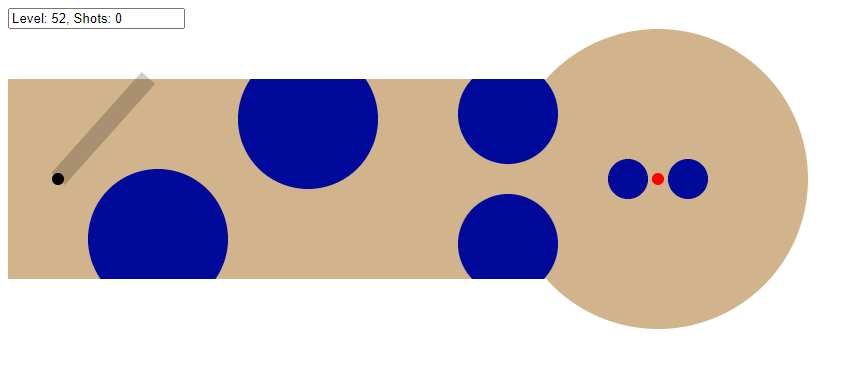

# Mini Code Golf

My entry for [Algorithm-Arena](https://github.com/Algorithm-Arena) [Weekly Challenge #11](https://github.com/Algorithm-Arena/weekly-challenge-11-mini-code-golf).

Play the game here: https://benjaminaster.github.io/mini-code-golf/

Demo video: https://www.youtube.com/watch?v=2vIFzDxzrYk

<big>**Code size: `1099` bytes.**</big>

## Key features
- Real physics with rectangular & circular collisions (both from inside & from outside)
- Physics & ball speed independent of device frame rate
- Playable on mobile with touch
- 52 levels

## How to play
- Click anywhere on the screen and drag your mouse/finger around to aim the ball.
- Try to push the ball into the goal (the red circle).

## Code architecture
The human-readable code is located in [main.js](./main.js) and is then compiled via [compile.js](./compile.js) into [index.html](./index.html).

